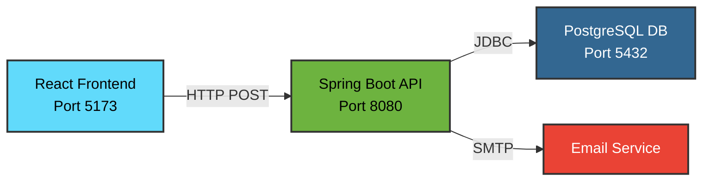
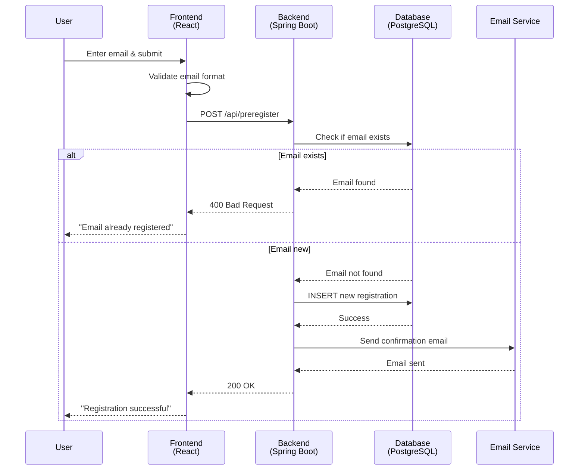

# Full-Stack Connection Architecture

## System Overview



## Data Flow

### Registration Flow



## Technology Stack

| Layer | Technology | Purpose |
|-------|------------|---------|
| **Frontend** | React 19 + TypeScript + Vite | User interface and form handling |
| **Backend** | Spring Boot 3.2 + Java 17 | REST API and business logic |
| **Database** | PostgreSQL 14+ | Persistent data storage |
| **ORM** | Spring Data JPA (Hibernate) | Database abstraction |
| **Email** | Spring Mail + SMTP | Email notifications |
| **Build Tools** | Maven (Backend), npm (Frontend) | Dependency management |

## File Structure

```
references---global-researcher-network/
│
├── 📁 java-backend/              # Spring Boot Backend
│   ├── PreregistrationApp.java  # Main app + Controllers
│   ├── application.properties   # DB & Email config
│   └── pom.xml                  # Maven dependencies
│
├── 📁 db/                        # Database
│   └── schema.sql               # PostgreSQL schema
│
├── 📁 components/                # React Components
│   ├── Header.tsx
│   ├── Hero.tsx
│   ├── FeatureSection.tsx
│   └── Footer.tsx
│
├── App.tsx                      # Main React component
├── index.tsx                    # React entry point
├── package.json                 # npm dependencies
│
├── start-backend.bat            # Quick start script
├── start-frontend.bat           # Quick start script
├── SETUP_GUIDE.md              # Detailed setup
└── README.md                    # Quick reference
```

## Connection Points

### 1. Frontend → Backend
- **File**: `App.tsx` (line 19)
- **Method**: HTTP POST with fetch API
- **URL**: `http://localhost:8080/api/preregister`
- **Headers**: `Content-Type: application/json`
- **Body**: `{ "email": "user@example.com" }`

### 2. Backend → Database
- **File**: `application.properties` (lines 5-7)
- **Method**: JDBC via Spring Data JPA
- **URL**: `jdbc:postgresql://localhost:5432/references_db`
- **Driver**: PostgreSQL Driver (auto-loaded from pom.xml)

### 3. Backend → Email Service
- **File**: `application.properties` (lines 17-22)
- **Method**: SMTP via Spring Mail
- **Service**: Gmail or any SMTP server
- **Port**: 587 (TLS)

## API Contract

### Endpoint: POST /api/preregister

**Request**:
```json
{
  "email": "john.doe@example.com"
}
```

**Success Response (200)**:
```json
{
  "success": true,
  "message": "Registration successful."
}
```

**Error Response (400)**:
```json
{
  "success": false,
  "message": "Email already registered."
}
```

## Database Schema

```sql
CREATE TABLE preregistrations (
    id UUID PRIMARY KEY DEFAULT gen_random_uuid(),
    email VARCHAR(255) UNIQUE NOT NULL,
    created_at TIMESTAMP WITH TIME ZONE DEFAULT CURRENT_TIMESTAMP
);
```

## Environment Variables & Configuration

### Required Configuration

1. **PostgreSQL Credentials** (`application.properties`):
   - `spring.datasource.username`
   - `spring.datasource.password`

2. **Email Settings** (Optional, `application.properties`):
   - `spring.mail.username`
   - `spring.mail.password`

### Default Ports

- Frontend: `5173` (Vite default)
- Backend: `8080` (Spring Boot default)
- PostgreSQL: `5432` (PostgreSQL default)

## Security Notes

- CORS is enabled for all origins (`@CrossOrigin(origins = "*")`) - **Change this for production!**
- Database password is in plaintext - **Use environment variables for production!**
- Email password should use Google App Passwords, not your actual Gmail password

## Next Steps

1. ✅ Configure PostgreSQL credentials
2. ✅ Run database schema
3. ✅ Start backend server
4. ✅ Start frontend server
5. ✅ Test the connection
6. 🔒 Secure for production (CORS, env vars, HTTPS)
